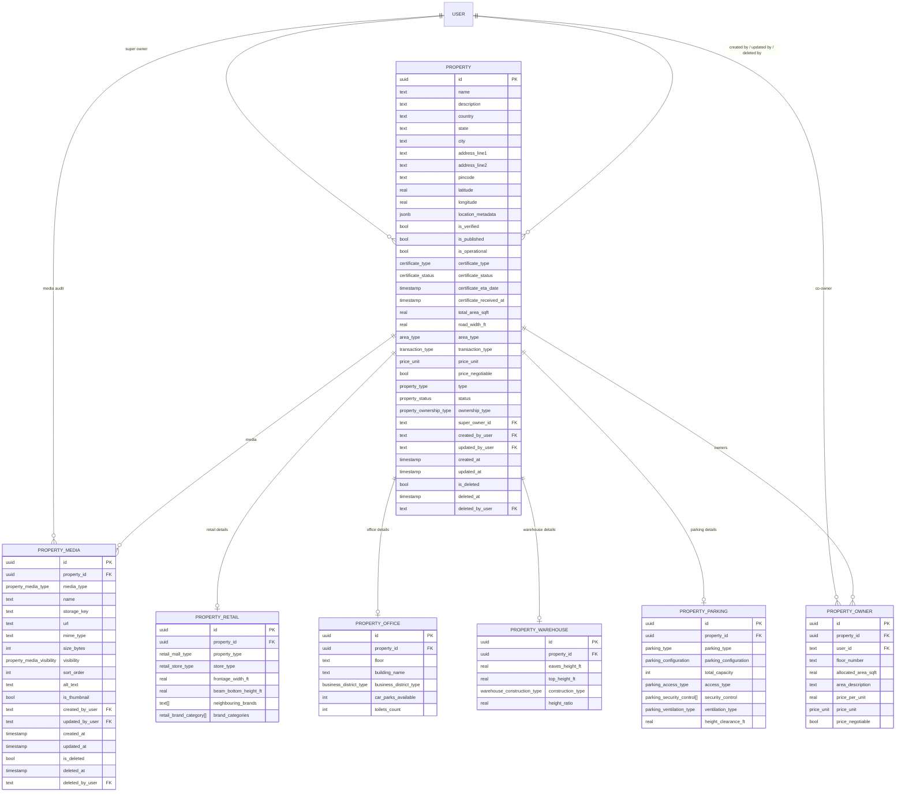

# Property Schema Overview

This is the full property model in one place: the core `property` table, the type-specific extension tables, and the ownership junction.

## Required Fields

`property` required fields:
- `name`
- `country`
- `state`
- `city`
- `addressLine1`
- `pincode`
- `isVerified`
- `isPublished`
- `isOperational`
- `certificateType`
- `certificateStatus`
- `areaType`
- `priceNegotiable`
- `type`
- `status`
- `ownershipType`
- `createdAt`
- `updatedAt`
- `isDeleted`

Extension table required fields:
- `property_retail.propertyId`, `property_retail.propertyType`, `property_retail.storeType`
- `property_office.propertyId`
- `property_warehouse.propertyId`
- `property_parking.propertyId`, `property_parking.parkingType`, `property_parking.parkingConfiguration`
- `property_owner.propertyId`, `property_owner.userId`
- `property_media.propertyId`, `property_media.mediaType`, `property_media.name`, `property_media.storageKey`, `property_media.url`, `property_media.visibility`

## Relationship Notes

- `property.superOwnerId -> user.id`
- `property.createdByUser / updatedByUser / deletedByUser -> user.id`
- `property_owner.userId -> user.id`
- `property_owner.propertyId -> property.id`
- `property_media.propertyId -> property.id`
- `property_media.createdByUser / updatedByUser / deletedByUser -> user.id`
- Each subtype table is `1:0..1` from `property`
- `property.owners` is `1:N` through `property_owner`
- `property.mediaItems` is `1:N` through `property_media`
- `ownershipType = SINGLE_OWNER` means only `superOwner` is expected
- `ownershipType = MULTIPLE_OWNER` means `property_owner` rows are also expected

## Field Groups

- Identity: `id`, `name`, `description`
- Location: `country`, `state`, `city`, `addressLine1`, `addressLine2`, `pincode`, `latitude`, `longitude`
- Search metadata: `locationMetadata`
- Operational: `isVerified`, `isPublished`, `isOperational`
- Certificate: `certificateType`, `certificateStatus`, `certificateEtaDate`, `certificateReceivedAt`
- Area and pricing: `totalAreaSqft`, `roadWidthFt`, `areaType`, `transactionType`, `priceUnit`, `priceNegotiable`
- Classification: `type`, `status`, `ownershipType`
- Ownership and audit: `superOwnerId`, `createdByUser`, `updatedByUser`, `createdAt`, `updatedAt`, `isDeleted`, `deletedAt`, `deletedByUser`
- Media: `property_media`

## Operational Rule

Keep `isOperational` aligned with `certificateStatus`:

- `PENDING` -> `isOperational = false`
- `RECEIVED` -> `isOperational = true`
- `NOT_REQUIRED` -> `isOperational = true`

Suggested transition behavior:

- When `certificateStatus` becomes `RECEIVED`, stamp `certificateReceivedAt` if it is empty.
- When `certificateStatus` becomes `PENDING`, clear `certificateReceivedAt`.
- When `certificateStatus` becomes `NOT_REQUIRED`, keep `certificateReceivedAt` as-is or `null` if you prefer to avoid implying a receipt event.
